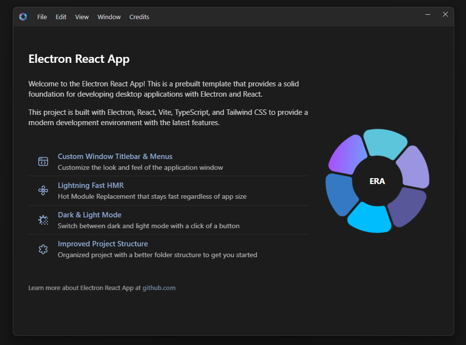

# ElectronForge

<br />
<p align="center">
    
</p>

🚀 一个现代化、生产就绪的 Electron 应用程序模板，集成了 React、Vite、TypeScript、HeroUI 和 TailwindCSS。ElectronForge 为使用最新 Web 技术开发美观的跨平台桌面应用程序提供了坚实的基础。

<br />

<p align="center">
    
</p>

<br />

## 特性

- 🚀 Electron - 跨平台桌面应用程序框架
- ⚛️ React - 基于组件的 UI 库
- 📦 TypeScript - 类型安全的 JavaScript
- 🎨 HeroUI - 美观且易于访问的组件库
- 🎨 TailwindCSS - 实用优先的 CSS 框架
- ⚡ Vite - 闪电般快速的构建工具
- 🔥 快速热重载 - 热模块替换
- 🎨 深色/浅色模式 - 内置主题切换
- 🪟 自定义窗口和标题栏 - 专业外观的窗口，带有自定义标题栏和文件菜单
- 📐 清晰的项目结构 - 主进程和渲染进程分离
- 🧩 路径别名 - 保持代码组织有序
- 🛠️ Electron Builder - 配置好的应用程序打包

<br />

## 前置要求

- Node.js (v18 或更高版本)
- bun

<br />

## 安装

克隆仓库并安装依赖：

```bash
# 克隆仓库
git clone https://github.com/yourusername/electron-forge
cd electron-forge

# 安装依赖
bun install
```

<br />

## 开发

启动开发服务器：

```bash
bun run dev
```

这将启动带有热重载功能的 Electron，让您可以实时查看更改。

<br />

## 生产构建

为您的平台构建应用程序：

```bash
# Windows 平台
bun run build:win

# macOS 平台
bun run build:mac

# Linux 平台
bun run build:linux

# 所有平台的未打包版本
bun run build:unpack
```

分发文件将位于 `dist` 目录中。

<br />

## IPC 通信

应用程序使用安全的 IPC（进程间通信）系统在渲染进程和主进程之间进行通信：

```ts
// 渲染进程（向主进程发送消息）
window.api.send('channel-name', ...args)

// 渲染进程（从主进程接收消息）
window.api.receive('channel-name', (data) => {
  console.log(data)
})

// 渲染进程（调用主进程中的方法并获取响应）
const result = await window.api.invoke('channel-name', ...args)
```

<br />

## 自定义窗口组件

此模板包含自定义窗口实现，具有以下功能：

- 带有应用程序图标的自定义标题栏
- 窗口控制按钮（最小化、最大化、关闭）
- 带有键盘快捷键的菜单系统
- 深色/浅色模式切换
- Windows 和 macOS 的跨平台支持

<br />

### 标题栏菜单切换

可以使用以下方式切换标题栏菜单：

- **Windows**: 按 `Alt` 键
- **macOS**: 按 `Option (⌥)` 键

当您按下切换键时：

- 如果菜单隐藏，它将变为可见
- 如果菜单已经可见，它将被隐藏
- 只有在有菜单项可用时，菜单才会切换

<br />

### 自定义菜单项

要添加、删除或修改菜单项，请更新 `lib/window/titlebarMenus.ts` 文件。

<br />

## Tailwind 样式

项目支持使用 **TailwindCSS** 进行样式设计：

```ts
// 使用 Tailwind 类的示例组件
const Button = () => (
  <button className="px-4 py-2 bg-blue-500 text-white rounded hover:bg-blue-600">
    点击我
  </button>
);
```

<br />

## 贡献

欢迎贡献！请随时提交 Pull Request。

<br />

## 项目结构

<!-- prettier-ignore-start -->
```markdown
├── app/                        # 渲染进程文件
│   ├── assets/                 # 静态资源（图片、字体等）
│   ├── components/             # React 组件
│   │   ├── App.tsx             # 应用程序组件
│   ├── styles/                 # CSS 和 Tailwind 文件
│   │   ├── app.css             # 应用程序样式表
│   │   └── tailwind.css        # Tailwind 样式表
│   ├── index.html              # 入口 HTML 文件
│   └── renderer.tsx            # 渲染进程入口
├── lib/                        # 共享库代码
│   ├── main/                   # 主进程代码
│   │   ├── index.ts            # Electron 主入口点
│   │   └── ...                 # 其他主进程模块
│   ├── preload/                # IPC 预加载脚本
│   │   ├── index.ts            # 预加载脚本入口
│   │   └── api.ts              # 渲染器暴露的 API
│   ├── welcome/                # 欢迎套件组件
│   └── window/                 # 自定义窗口实现
├── resources/                  # 构建资源
├── .eslintrc                   # ESLint 配置
├── .prettierrc                 # Prettier 格式配置
├── electron-builder.yml        # Electron 构建器配置
├── electron.vite.config.ts     # Electron 的 Vite 配置
├── package.json                # 项目依赖和脚本
└── tsconfig.node.json          # 主进程 tsconfig
└── tsconfig.web.json           # 渲染进程 tsconfig

```
<!-- prettier-ignore-end -->
