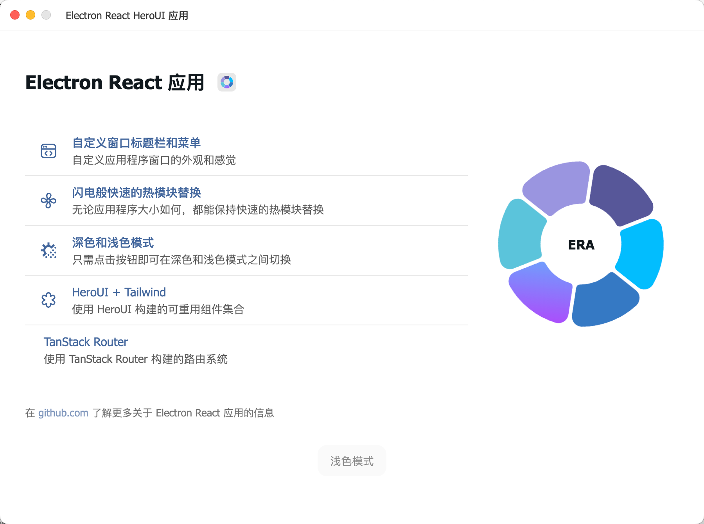

# ElectronForge

<br />
<p align="center">
    
</p>

🚀 A modern, production-ready Electron application template with React, Vite, TypeScript, HeroUI, and TailwindCSS. ElectronForge provides a solid foundation for developing beautiful cross-platform desktop applications with the latest web technologies.

<br />

<p align="center">
    
</p>

<p align="center">
    <a href="https://imgur.com/B5pGkDk">Watch Video Preview</a>
</p>

<br />

## Features

- 🚀 Electron - Cross-platform desktop application framework
- ⚛️ React - Component-based UI library
- 📦 TypeScript - Type-safe JavaScript
- 🎨 HeroUI - Beautiful and accessible component library
- 🎨 TailwindCSS - Utility-first CSS framework
- ⚡ Vite - Lightning-fast build tool
- 🔥 Fast HMR - Hot Module Replacement
- 🎨 Dark/Light Mode - Built-in theme switching
- 🪟 Custom Window & Titlebar - Professional-looking window with custom titlebar & file menus
- 📐 Clean Project Structure - Separation of main and renderer processes
- 🧩 Path Aliases – Keep your code organized
- 🛠️ Electron Builder - Configured for packaging applications

<br />

## Prerequisites

- Node.js (v18 or higher)
- npm, yarn, pnpm, or bun

<br />

## Installation

Clone the repository and install dependencies:

```bash
# Clone the repository
git clone https://github.com/yourusername/electron-forge
cd electron-forge

# Install dependencies
npm install
# or
yarn
# or
pnpm install
# or
bun install
```

<br />

## Development

Start the development server:

```bash
npm run dev
# or
yarn dev
# or
pnpm dev
# or
bun run dev
```

This will start Electron with hot-reload enabled so you can see changes in real time.

<br />

## Building for Production

Build the application for your platform:

```bash
# For Windows
npm run build:win

# For macOS
npm run build:mac

# For Linux
npm run build:linux

# Unpacked for all platforms
npm run build:unpack
```

Distribution files will be located in the `dist` directory.

<br />

## IPC Communication

The app uses a secure IPC (Inter-Process Communication) system to communicate between the renderer and main processes:

```ts
// Renderer process (send message to main)
window.api.send('channel-name', ...args)

// Renderer process (receive message from main)
window.api.receive('channel-name', (data) => {
  console.log(data)
})

// Renderer process (invoke a method in main and get a response)
const result = await window.api.invoke('channel-name', ...args)
```

<br />

## Custom Window Components

This template includes a custom window implementation with:

- Custom titlebar with app icon
- Window control buttons (minimize, maximize, close)
- Menu system with keyboard shortcuts
- Dark/light mode toggle
- Cross-platform support for Windows and macOS

<br />

### Titlebar Menu Toggle

The titlebar menu can be toggled using:

- **Windows**: Press the `Alt` key
- **macOS**: Press the `Option (⌥)` key

When you press the toggle key:

- If the menu is hidden, it becomes visible
- If the menu is already visible, it gets hidden
- The menu only toggles if menu items are available

<br />

### Customizing Menu Items

To add, remove or modify menu items, update the `lib/window/titlebarMenus.ts` file.

<br />

## Tailwind Styling

The project supports **TailwindCSS** for styling:

```ts
// Example component with Tailwind classes
const Button = () => (
  <button className="px-4 py-2 bg-blue-500 text-white rounded hover:bg-blue-600">
    Click me
  </button>
);
```

<br />

## Contributing

Contributions are welcome! Feel free to submit a Pull Request.

<br />

## Project Structure

<!-- prettier-ignore-start -->
```markdown
├── app/                        # Renderer process files
│   ├── assets/                 # Static assets (images, fonts, etc)
│   ├── components/             # React components
│   │   ├── App.tsx             # Application component
│   ├── styles/                 # CSS and Tailwind files
│   │   ├── app.css             # App stylesheet
│   │   └── tailwind.css        # Tailwind stylesheet
│   ├── index.html              # Entry HTML file
│   └── renderer.tsx            # Renderer process entry
├── lib/                        # Shared library code
│   ├── main/                   # Main process code
│   │   ├── index.ts            # Main entry point for Electron
│   │   └── ...                 # Other main process modules
│   ├── preload/                # Preload scripts for IPC
│   │   ├── index.ts            # Preload script entry
│   │   └── api.ts              # Exposed API for renderer
│   ├── welcome/                # Welcome kit components
│   └── window/                 # Custom window implementation
├── resources/                  # Build resources
├── .eslintrc                   # ESLint configuration
├── .prettierrc                 # Prettier format configuration
├── electron-builder.yml        # Electron builder configuration
├── electron.vite.config.ts     # Vite configuration for Electron
├── package.json                # Project dependencies and scripts
└── tsconfig.node.json          # Main process tsconfig
└── tsconfig.web.json           # Renderer process tsconfig

```
<!-- prettier-ignore-end -->
